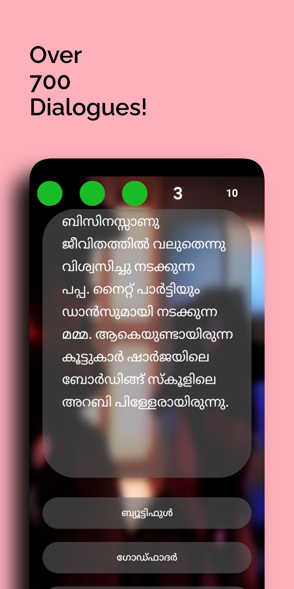

# Chalachithram 
An Android quiz app based on dialogues from popular movies of Malayalam film industry.

It has over 700 dialogues with three time controls and an additional mode that one can unlock by obtaining more than 100 points for the toughest time control(Shaji Kailas round).

The three time controls are: 
* Shaji Kailas round (5 sec / question)
* Sadha round (15 sec / question )
* Amal Neerad round (30 sec / question)

and the unlockable mode:
* Santosh Pandit round (2 sec / question)

Score 200+ points in Santosh Pandit round to win the game (which no sane man who values time should ever do).

### Installation

You can also download it from the [Releases](https://github.com/VivekThazhathattil/Chalachithram/releases).

### Contribution

You may contribute to this app by utilizing GitHub issues and pull requests. Contributions in the form of more dialogues from malayalam movies are also highly encouraged.

### Issues

If you encounter any bugs, or have an enhancement/idea, you may raise a GitHub issue. You can contact me directly at vivek.thazhathattil@gmail.com. I'm open to suggestions and criticisms of any kind.

## Screenshots

